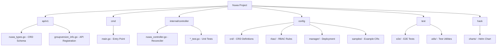

# Nuwa - Kubernetes Application Deployment Simplifier

## Project Vision

Nuwa is a Kubernetes CRD controller built with kubebuilder that simplifies K8s application deployment. It abstracts away the complexity of Kubernetes workload management by providing a single, unified `Nuwa` custom resource. Users only need to configure basic information (image, environment variables, ports, storage), and Nuwa automatically creates and manages the underlying OpenKruise CloneSet and Service resources.

## Architecture Overview

```
+------------------+     +-------------------+     +------------------+
|   Nuwa CRD       | --> | Nuwa Controller   | --> | CloneSet (Kruise)|
| (User Config)    |     | (Reconciler)      |     | + Service        |
+------------------+     +-------------------+     +------------------+
```

**Core Components:**
- **API Layer** (`api/v1/`): Defines the Nuwa CRD schema with NuwaSpec and NuwaStatus
- **Controller** (`internal/controller/`): Reconciles Nuwa resources to CloneSet and Service
- **Config** (`config/`): Kubernetes manifests for CRD, RBAC, and deployment

**Key Dependencies:**
- `sigs.k8s.io/controller-runtime` v0.23.1 - Controller framework
- `github.com/openkruise/kruise-api` v1.8.0 - OpenKruise CloneSet API
- `k8s.io/apimachinery` v0.35.0 - Kubernetes API machinery

## Module Structure



## Module Index

| Module | Path | Description | Language | Has Tests |
|--------|------|-------------|----------|-----------|
| API Types | `api/v1/` | CRD schema definitions (NuwaSpec, NuwaStatus, PortMapping, StorageSpec) | Go | No |
| Controller | `internal/controller/` | Nuwa reconciler - creates CloneSet and Service | Go | Yes |
| Entry Point | `cmd/` | Manager bootstrap and configuration | Go | No |
| CRD Config | `config/crd/` | CustomResourceDefinition YAML | YAML | - |
| RBAC Config | `config/rbac/` | Role, RoleBinding, ServiceAccount | YAML | - |
| Manager Config | `config/manager/` | Controller Deployment | YAML | - |
| E2E Tests | `test/e2e/` | End-to-end integration tests | Go | Yes |
| Helm Chart | `hack/charts/` | Helm chart for deployment | YAML | - |

## Development & Operations

### Prerequisites
- Go 1.25+
- Kubernetes cluster with OpenKruise installed
- kubectl configured

### Build & Run
```bash
# Build the controller binary
go build -o bin/manager cmd/main.go

# Run locally (requires kubeconfig)
./bin/manager --metrics-bind-address=:8080 --health-probe-bind-address=:8081

# Build Docker image
docker build -t nuwa:latest .
```

### Deploy to Cluster
```bash
# Install CRDs
kubectl apply -f config/crd/bases/

# Deploy controller (using kustomize)
kubectl apply -k config/default/
```

### Create a Nuwa Resource
```yaml
apiVersion: app.12306.work/v1
kind: Nuwa
metadata:
  name: my-app
spec:
  image: nginx:latest
  replicas: 2
  ports:
    - name: http
      containerPort: 80
  env:
    - name: TZ
      value: Asia/Shanghai
```

## Testing Strategy

| Test Type | Location | Framework | Run Command |
|-----------|----------|-----------|-------------|
| Unit Tests | `internal/controller/*_test.go` | Ginkgo/Gomega | `go test ./internal/controller/...` |
| E2E Tests | `test/e2e/` | Ginkgo/Gomega | `go test -tags=e2e ./test/e2e/...` |

**Test Coverage:**
- Controller reconciliation logic
- CloneSet and Service creation
- Metrics endpoint validation

## Coding Standards

### Linting
- **Tool**: golangci-lint (`.golangci.yml`)
- **Enabled Linters**: errcheck, govet, staticcheck, revive, gocyclo, dupl, misspell, unused

### Code Style
- Follow standard Go conventions
- Use kubebuilder markers for CRD generation
- Keep controller logic in `Reconcile()` method
- Use `controllerutil` for owner references and finalizers

### Key Patterns
```go
// Reconciler pattern
func (r *NuwaReconciler) Reconcile(ctx context.Context, req ctrl.Request) (ctrl.Result, error) {
    // 1. Fetch resource
    // 2. Handle deletion (finalizers)
    // 3. Reconcile child resources (CloneSet, Service)
    // 4. Update status
}
```

## AI Usage Guidelines

### When Working on This Project
1. **CRD Changes**: Modify `api/v1/nuwa_types.go`, then run `make generate manifests`
2. **Controller Logic**: Edit `internal/controller/nuwa_controller.go`
3. **RBAC Updates**: Check `config/rbac/role.yaml` for required permissions
4. **Testing**: Add tests in `internal/controller/nuwa_controller_test.go`

### Important Files to Read First
1. `api/v1/nuwa_types.go` - Understand the CRD schema
2. `internal/controller/nuwa_controller.go` - Core reconciliation logic
3. `config/samples/app_v1_nuwa.yaml` - Example usage

### Common Tasks
- **Add new field to CRD**: Edit `NuwaSpec` in `nuwa_types.go`, regenerate manifests
- **Change reconciliation behavior**: Modify `reconcileCloneSet()` or `reconcileService()`
- **Add new storage type**: Extend `StorageType` enum and `buildCloneSet()` switch

## Changelog

### 2026-01-31T22:17:51+0800 - Initial Context Creation
- Created project documentation structure
- Analyzed all source files and configurations
- Generated module index and architecture overview
